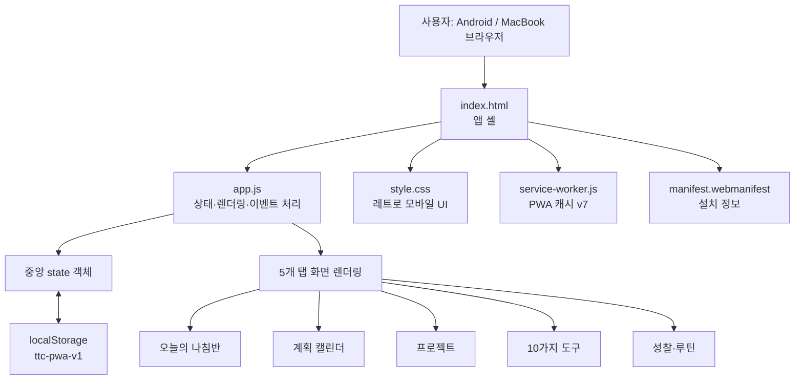
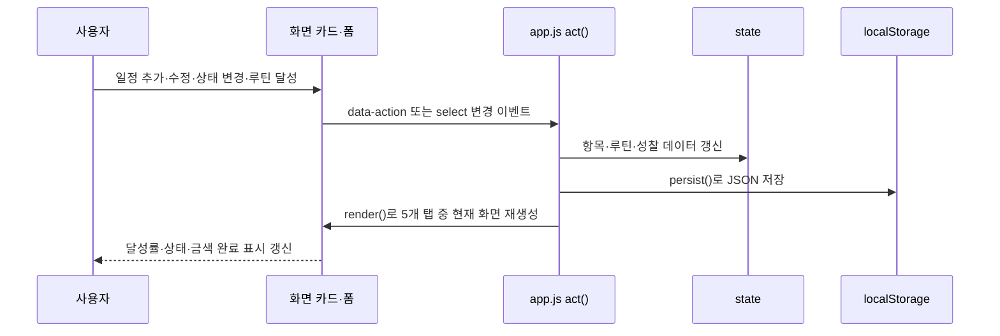

# Time Tipping Compass 구현 구조 보고서

| 구분 | 내용 |
|---|---|
| 프로젝트명 | **Time Tipping Compass** |
| 대상 | Android 우선, MacBook 브라우저 호환 개인 시간관리 PWA |
| 구현 기준 | 리치 노튼의 『인생이 바뀌는 시간관리의 비밀』에 제시된 시간 장악 도구를 행동·계획·성찰 흐름으로 재구성 |
| 작성일 | 2026년 8월 21일 |
| 현재 배포 형태 | 정적 웹 기반 Progressive Web App(PWA), 로컬 저장소 기반 |
| 데이터 저장 위치 | 사용자 브라우저의 `localStorage` 키 `ttc-pwa-v1` |
| 최신 캐시 버전 | `ttc-pwa-v7` |

## 1. 개발 목적과 구현 범위

본 애플리케이션은 해야 할 일, 하고 싶은 일, 걱정거리처럼 머릿속에 분산된 생각을 **날짜·영역·우선순위·루틴·성찰 기록**으로 분해하여 실행 가능한 계획으로 바꾸도록 설계하였다. 특히 계획형 생활 습관을 만들고 싶지만 생각이 많고 산만함을 자주 느끼는 사용자를 고려하여, 첫 화면에서는 한 가지 다음 행동만 강조하고, 세부 기록은 접기·펼치기와 탭 이동을 통해 필요할 때만 보이도록 구성하였다.

> **핵심 원칙:** 생각을 더 많이 쌓는 것이 아니라, 지금 할 행동을 하나로 좁히고 완료·성찰의 반복을 통해 시간을 의도적으로 배치한다.

현재 버전은 서버 계정, 원격 데이터베이스, GitHub 연동 없이도 독립적으로 동작한다. 즉, Android 휴대폰과 MacBook의 최신 브라우저에서 링크를 열거나 PWA로 설치해 사용할 수 있으며, 기록은 각 기기의 브라우저 저장소에 보존된다. `localStorage`는 브라우저 세션이 종료된 뒤에도 같은 출처의 데이터를 보존하는 웹 저장소이므로, 본 앱의 경량·로컬 우선 목적에 적합하다.[1]

| 구현 완료 범위 | 현재 상태 |
|---|---|
| 오늘의 집중 화면, 4대 영역, 우선순위 요약 | 구현 완료 |
| 월간·요일별 캘린더, 복합 필터, 일정·할 일 CRUD | 구현 완료 |
| 주간·월간·연간 루틴, 고정·비고정 일정, 달성 기록 | 구현 완료 |
| 10가지 시간 장악 도구, 무작위 추천, 기록 저장 | 구현 완료 |
| 성찰 기록 CRUD | 구현 완료 |
| PWA 매니페스트·서비스 워커·오프라인 폴백 | 구현 완료 |
| GitHub 동기화, 기기 간 동기화, APK 패키징 | 보류 |
| 수집함(Inbox), 막힘 상태, 알림 시간 | 향후 구현 예정 |

## 2. 전체 기술 아키텍처

앱은 프레임워크 의존성을 최소화한 **Vanilla HTML/CSS/JavaScript** 구조이다. 화면은 하나의 HTML 셸에 렌더링되고, JavaScript의 중앙 상태 객체를 변경한 뒤 전체 화면을 다시 그리는 방식으로 동작한다. 데이터는 로컬 저장소에 JSON으로 직렬화되어 저장되며, 서비스 워커는 앱 셸 자산을 관리하여 네트워크 문제가 있을 때 캐시를 보조적으로 활용한다.

| 계층 | 구성 요소 | 역할 |
|---|---|---|
| 진입 계층 | `index.html` | 반응형 viewport, 테마색, 매니페스트, CSS·JS 버전 참조, 앱 루트 `<main id="app">` 제공 |
| 화면·상태 계층 | `app.js` | 데이터 모델, 로컬 저장소 읽기·쓰기, 화면 렌더링, CRUD, 필터·달성률·주간 날짜 계산, 이벤트 처리 |
| 표현 계층 | `style.css` | 1980년대 플래너 스타일, 모바일 우선 카드·접기·탭·달성률·주간 캘린더·완료 스탬프 |
| PWA 계층 | `manifest.webmanifest`, `service-worker.js` | 홈 화면 설치 정보, 독립 창 실행, 앱 셸 캐시 및 오프라인 폴백 |
| 미리보기 계층 | `server.js` | 포트 `4173`에서 정적 파일 제공, 경로 정규화 및 서버 캐시 방지 헤더 제공 |

서비스 워커는 웹 앱과 네트워크 사이에서 요청을 제어하고 자산 캐시를 관리하는 표준 웹 기술이다.[2] 현재 구현은 우선 네트워크에서 최신 파일을 요청하고, 요청 실패 시 캐시된 파일을 반환하는 단순한 **network-first with cache fallback** 정책을 사용한다. 기능 업데이트 시 `service-worker.js`, `index.html`, `app.js`의 버전을 함께 올려 오래된 화면이 재사용되지 않도록 관리한다.

## 3. 화면 정보 구조

사용자 흐름은 하단 고정 탭 5개로 구성된다. Android 화면에서 엄지손가락으로 접근하기 쉬운 하단 내비게이션을 유지하면서, 상단 내용은 한 화면에 과도하게 노출되지 않도록 카드와 `
` 접기 구조를 사용하였다.

| 탭 | 주요 역할 | 핵심 화면 요소 |
|---|---|---|
| **오늘** | 오늘의 방향과 바로 실행할 한 가지 행동 제시 | 최종 목적문, 4대 영역 바로가기, 중요 할 일, 다음 행동, 달성률, 과거·오늘·예정 접이식 목록, 루틴 요약 |
| **캘린더** | 일정·할 일의 생성·수정·삭제 및 기간별 확인 | 월간 보기, 요일별 주간 보기, 날짜 선택기, 영역·시간대·상태·우선순위 필터, 날짜별 기록 폼 |
| **프로젝트** | 장기 결과를 프로젝트 단위로 관리 | 프로젝트 이름, 완료 기준, 생성·수정·삭제 카드 |
| **도구** | 시간 장악 도구를 상황별로 활용 | 오늘의 무작위 도구, 10개 도구 라이브러리, 사용 시점·3단계 안내, 기록 저장·수정·삭제 |
| **성찰** | 루틴 달성과 주간 검토를 연결 | 주간·월간·연간 루틴, 달성률, 상태 변경, 성찰 3문항, 저장 이력 |

## 4. 데이터 모델과 저장 방식

모든 기록은 하나의 `state` 객체에 저장된다. 저장 직전에는 편집 중인 화면 상태만 제외하고 JSON 형태로 `localStorage`에 기록한다. 따라서 새로고침 이후에도 일정, 루틴, 프로젝트, 도구 기록, 성찰 기록이 남는다. 단, 동일한 브라우저 출처와 기기 안에서만 유지되며, 다른 휴대폰·다른 브라우저와는 자동 공유되지 않는다.[1]

| 데이터 영역 | 핵심 필드 | 목적 |
|---|---|---|
| 목적문 | `purpose` | 최종 목적을 한 문장으로 기록하고 오늘 화면의 기준점으로 사용 |
| 프로젝트 | `id`, `title`, `outcome` | 결과가 보이는 실행 단위를 관리 |
| 일정·할 일 | `id`, `title`, `type`, `date`, `area`, `status`, `priority` | 날짜, 4대 영역, 상태, 중요도를 가진 핵심 실행 기록 |
| 루틴 | `id`, `title`, `cadence`, `target`, `completions`, `fixed`, `weekday`, `active`, `statusByPeriod`, `scheduledDates` | 주기별 목표와 고정·선택형 배치, 달성 이력을 관리 |
| 도구 기록 | `notes[toolId]` | 시간 장악 도구별 작성 메모를 저장 |
| 성찰 기록 | `reflectionEntries[]` | 잘한 선택·마찰·더 좋은 질문 및 작성 시각을 저장 |
| 화면 상태 | `active`, `selectedDate`, `calendarMode`, `calendarLayout`, 필터 값 | 현재 탭, 선택 날짜, 월/주 보기, 필터 등 UI 상태를 유지 |

### 4.1 일정·할 일 상태 체계

일정과 할 일은 **계획 → 진행 → 완료** 세 상태로 직접 변경할 수 있다. 상태와 별도로 중요도를 중요·보통·나중으로 관리하며, 달성률은 완료 기록 수를 기준으로 계산한다. 4대 영역은 개인, 경력, 사람, 여가이며, 오늘 화면과 캘린더에서 영역별 성과를 따로 확인할 수 있다.

| 속성 | 값 | 구현 목적 |
|---|---|---|
| 유형 | 할 일 / 일정 | 실행성 작업과 시간 약속을 구분 |
| 상태 | 계획 / 진행 / 완료 | 실행 단계와 완료 여부를 표현 |
| 중요도 | 중요 / 보통 / 나중 | 산만함을 줄이기 위한 우선순위 정렬 |
| 영역 | 개인 / 경력 / 사람 / 여가 | 삶의 균형을 확인하고 필터링 |
| 날짜 이동 | 하루 당기기 / 하루 미루기 | 계획이 바뀔 때 재배치하되, 미루기는 확인 후 실행 |

### 4.2 루틴 상태 및 주기 계산

루틴은 주간·월간·연간 단위로 구분되며, 각 주기마다 목표 횟수와 달성 횟수를 계산한다. 주간 키는 ISO 주차 형태, 월간 키는 `YYYY-MM`, 연간 키는 `YYYY`로 계산한다. 사용자가 상태 선택기에서 계획·진행·완료를 직접 바꾸면 `statusByPeriod`에 해당 주기의 상태를 저장한다. 실제 달성 기록을 추가하면 그 주기의 수동 상태를 제거하고 달성 횟수를 다시 기준으로 계산한다.

| 루틴 방식 | 데이터 조건 | 캘린더 반영 방식 |
|---|---|---|
| 요일 고정 루틴 | `fixed: true`, `weekday: 0~6` | 해당 요일의 주간 카드에 자동 표시 |
| 비고정 선택 루틴 | `fixed: false`, `scheduledDates: []` | 날짜별 “비고정 루틴 선택” 패널에서 선택한 날짜에만 표시 |
| 보류 루틴 | `active: false` | 루틴 목록에는 남지만 달성 버튼 및 주간 표시에서 제외 |

## 5. 핵심 기능 구현 상세

### 5.1 오늘의 나침반

오늘 화면은 복잡한 목록 전체를 먼저 보여 주지 않는다. 최종 목적문, 4대 영역 바로가기, 중요 우선순위 목록을 거친 뒤 **완료되지 않았고 날짜가 오늘 이후인 첫 작업**을 다음 행동으로 제시한다. 사용자는 여기서 곧바로 수정하거나 완료할 수 있다. 이후에만 지난 기록·오늘 할 일·예정된 할 일과 주기별 루틴을 접어서 확인한다.

이 구조는 정보량을 줄이는 동시에, 사용자가 “무엇부터 해야 하는가”에 빠르게 답하도록 설계한 것이다. 영역 버튼을 누르면 해당 영역으로 오늘의 집중 카드와 달성률이 즉시 좁혀진다.

### 5.2 월간 및 요일별 캘린더

캘린더는 월간 격자와 요일별 주간 보기를 전환할 수 있다. 월간 보기에서는 날짜별 기록 수와 영역·상태 점을 표시하며, 특정 날짜를 누르면 해당 날짜의 기록 편집 카드와 신규 등록 폼이 열린다. 주간 보기에서는 월요일부터 일요일까지의 카드에 일정·할 일과 루틴을 함께 배치한다.

| 기능 | 구현 방식 | 사용자 효과 |
|---|---|---|
| 월간 보기 | 7열 격자, 날짜별 기록 수·영역 점 | 한 달의 약속과 업무 밀도 확인 |
| 요일별 세로 보기 | 주간 카드를 세로로 나열 | 하루 단위 계획을 순서대로 점검 |
| 요일별 가로 보기 | 카드 최소 폭과 가로 스크롤 | 휴대폰에서 주간 계획을 넘겨 보기 |
| 날짜 선택기 | HTML `date` 입력 후 주 시작일 계산 | 과거·미래 특정 날짜로 빠른 이동 |
| 복합 필터 | 영역·시간대·상태·중요도 동시 적용 | 필요한 기록만 좁혀 확인 |
| 달성률 | 필터 결과 및 4대 영역별 완료 비율 계산 | 실행 진척을 수치로 확인 |

### 5.3 미루기 방지와 일정 조정

각 일정·할 일 카드에는 **하루 당기기**와 **하루 미루기**가 배치되어 있다. 하루 미루기는 즉시 실행되지 않고 “정말 하루 미루겠습니까?”라는 기본 확인 대화상자를 거친다. 확인 후에는 날짜가 하루 뒤로 이동하고 상태는 계획으로 되돌아가며, 사용자가 바뀐 날짜를 바로 확인하도록 선택 날짜와 주 시작일도 함께 변경된다.

이 설계는 미루기를 금지하기보다, 미루는 행동을 의식적인 재계획으로 바꾸는 데 목적이 있다. 반면 하루 당기기는 별도 확인 없이 날짜만 하루 앞당겨 빠른 실행을 지원한다.

### 5.4 10가지 시간 장악 도구

도구 탭에는 다음 10개 도구가 구조화되어 있다. 각 도구는 도구명, 한 줄 설명, 사용하기 좋은 상황, 3단계 작성 방법, 기록 질문, 저장 메모로 구성된다.

| 번호 | 시간 장악 도구 | 앱 내 활용 방식 |
|---:|---|---|
| 1 | 나의 최종 목적 찾기 | 목적문 작성·수정 |
| 2 | 프로젝트 만들기 | 결과 중심 프로젝트 정의 |
| 3 | EDO 목록 만들기 | 제거·위임·외주화·직접 실행 검토 |
| 4 | 우선순위로 프로젝트 겹치기 | 하나의 행동이 여러 영역에 주는 효과 정리 |
| 5 | 나 없이도 일이 되게 하기 | 문서화·자동화 규칙 설계 |
| 6 | 전문가에게 맡기기 | 결과 중심의 도움 요청 정리 |
| 7 | 돈 버는 방법 바꾸기 | 시간·가치·제약의 관계 점검 |
| 8 | 가치에 시간 쓰는 법 | 중요한 가치를 실제 일정에 배치 |
| 9 | 프리즘 생산성 창조하기 | 작은 행동의 다중 효과 발견 |
| 10 | 더 좋은 질문하기 | 막힘을 실행 질문으로 전환 |

전체 도구를 모두 읽지 않아도 되도록, 상단에는 무작위로 한 장을 추천하는 **오늘의 도구 한 장**을 배치하였다. 작성한 도구 기록은 별도 접이식 목록에 모이고, 다시 열어 수정·삭제할 수 있다.

### 5.5 성찰 기록

성찰 탭은 “이번 주에 잘한 선택”, “다음에 바꾸고 싶은 마찰”, “더 좋은 질문”의 세 문항을 기록하게 한다. 하나 이상의 문항이 입력되어야 저장되며, 저장 이후에는 이력 목록에서 날짜와 내용을 확인하고 수정·삭제할 수 있다. 성찰은 별도의 텍스트 기록에 그치지 않고, 주간 루틴과 같은 탭에 배치하여 달성 기록과 다음 계획 수정을 연결한다.

## 6. 사용자 인터랙션 및 상태 변경 흐름

이벤트 처리는 `data-action`, `data-item-status`, `data-routine-status` 속성을 중심으로 통합하였다. 따라서 항목마다 독립적인 이벤트 리스너를 장기 보관하지 않고, 매 렌더링 이후 현재 DOM에 필요한 동작을 다시 바인딩한다. 데이터 수정 이후에는 `persist()`와 `render()`를 연속 실행하여 저장 상태와 화면 상태가 일치하도록 구성하였다.

## 7. 디자인 및 사용성 설계

디자인은 1980년대 플래너와 종이 다이어리의 질감을 현대 모바일 화면에 적용한 것이다. 크림색 격자 배경, 청록·오렌지·이끼색·보라색의 제한된 팔레트, `Courier New` 중심의 고정폭 글꼴, 굵은 테두리, 픽셀형 그림자를 일관되게 사용하였다. 완료 항목에는 금색 줄과 `✓ 완료` 스탬프를 적용해 사용자가 완료를 시각적으로 즉시 인식할 수 있다.

| UX 원칙 | 구현 방식 |
|---|---|
| 첫 화면 단순화 | 다음 행동 1개와 중요 우선순위만 상단에 배치 |
| 정보 밀도 조절 | 기록·루틴·도구 라이브러리를 접기·펼치기로 처리 |
| 모바일 우선 | 최대 폭 720px, 하단 고정 5탭, 터치 가능한 큰 버튼·입력 영역 |
| 맥북 호환 | 넓은 화면에서 콘텐츠 폭을 제한하고, 주간 세로 보기를 2열로 확장 |
| 피드백 가시성 | 상태 배지, 진행 막대, 영역 색상, 완료 금색 스탬프, 삭제·미루기 확인창 |
| 접근성 보조 | `aria-live` 앱 루트, 상태 선택기의 `aria-label`, 진행 막대의 `role="progressbar"` 사용 |

## 8. PWA·로컬 데이터 운영 특성

앱은 `manifest.webmanifest`에서 이름, 짧은 이름, 독립 창 표시 모드, 테마색, 한국어 언어 정보를 제공한다. 브라우저가 PWA 설치를 지원하는 환경에서는 홈 화면에서 일반 앱처럼 실행할 수 있다. 서비스 워커는 `index.html`, `app.js`, `style.css`, 매니페스트를 캐시 대상으로 관리하며, 설치·활성화 시 이전 캐시를 삭제한다.

다만 현재의 로컬 우선 설계에는 분명한 범위가 있다. `localStorage`는 출처별로 분리되므로, 휴대폰과 MacBook 사이에 기록이 자동 동기화되지 않는다.[1] 또한 브라우저 저장 데이터 삭제, 사이트 데이터 초기화, 비공개 모드 종료 등에 따라 기록이 사라질 수 있다. 따라서 중요한 장기 기록을 보호하려면 향후 파일 내보내기 또는 Supabase 기반 동기화 기능을 추가해야 한다.

## 9. 검증 결과

구현 후 공개 미리보기 환경에서 화면 렌더링과 핵심 상호작용을 확인하였다. 특히 최신 주간 캘린더 업데이트에서는 캐시 문제로 발생한 초기 빈 화면을 수정한 뒤 서비스 워커 버전을 `ttc-pwa-v7`로 올려 기존 자산이 남지 않도록 처리하였다.

| 검증 항목 | 결과 |
|---|---|
| 공개 URL의 기본 렌더링 | 정상 확인 |
| 오늘 화면의 4대 영역·다음 행동·접이식 목록 | 정상 확인 |
| 프로젝트·도구·성찰의 생성·수정·삭제 흐름 | 정상 확인 |
| 월간 캘린더와 영역·시간대·상태·중요도 필터 | 정상 확인 |
| 요일별 주간 캘린더 세로·가로 보기 | 정상 확인 |
| 날짜 선택기로 특정 날짜·주 이동 | 정상 확인 |
| 하루 미루기 확인 대화상자 | 정상 확인 |
| 비고정 루틴 날짜 선택·선택 해제 | 정상 확인 |
| 고정·비고정·활성 상태 루틴 편집 | 정상 확인 |
| 완료 루틴의 금색 선·`✓ 완료` 스탬프 | 정상 확인 |
| JavaScript 문법 및 정적 서버 응답 | 정상 확인 |

## 10. 현재 한계와 다음 개발 우선순위

현재 버전은 개인용 로컬 PWA로서는 일정·루틴·성찰의 기본 순환을 제공하지만, 기기 간 동기화와 알림은 지원하지 않는다. 따라서 다음 단계는 사용자가 실제로 사용하며 누적한 기록 흐름을 훼손하지 않는 방향으로 진행해야 한다.

| 우선순위 | 제안 기능 | 기대 효과 |
|---:|---|---|
| 1 | **수집함(Inbox)** | 분류·날짜 없이 생각을 빠르게 저장하고 나중에 일정·프로젝트·도구 기록으로 전환 |
| 2 | **막힘(Blocked) 상태** | 진행하지 못하는 이유와 해결 조건을 기록하여 단순 미루기와 구분 |
| 3 | **알림 시간 설정** | 특정 시간의 로컬 알림으로 예정 행동을 상기 |
| 4 | **내보내기·가져오기** | 로컬 기록의 백업과 기기 이동 지원 |
| 5 | **Supabase 동기화** | Android·MacBook 간 동일 데이터 사용 |
| 6 | **Android APK 패키징** | Trusted Web Activity 또는 Expo/React Native 전환을 통한 설치 파일 제공 |
| 7 | **GitHub 연동** | 소스 코드 버전 관리·협업·배포 자동화 |

## 11. 결론

Time Tipping Compass는 단순한 체크리스트가 아니라, **목적 → 프로젝트 → 오늘의 한 가지 행동 → 일정·루틴 실행 → 성찰 → 다음 계획 수정**의 순환을 하나의 로컬 PWA 안에 구현한 시간관리 도구이다. 현재 버전은 Android 중심의 손쉬운 조작, MacBook 브라우저 호환, 레트로 플래너 감성, 로컬 데이터 지속성, 10가지 시간 장악 도구의 실제 기록 흐름을 모두 포함한다.

향후에는 수집함과 막힘 상태를 먼저 추가하여 생각 정리 기능을 강화하고, 사용성 검토 이후 백업·동기화·APK 패키징을 단계적으로 진행하는 것이 바람직하다.

## References

[1]: https://developer.mozilla.org/en-US/docs/Web/API/Window/localStorage "MDN Web Docs — Window: localStorage property"
[2]: https://developer.mozilla.org/en-US/docs/Web/API/Service_Worker_API "MDN Web Docs — Service Worker API"
